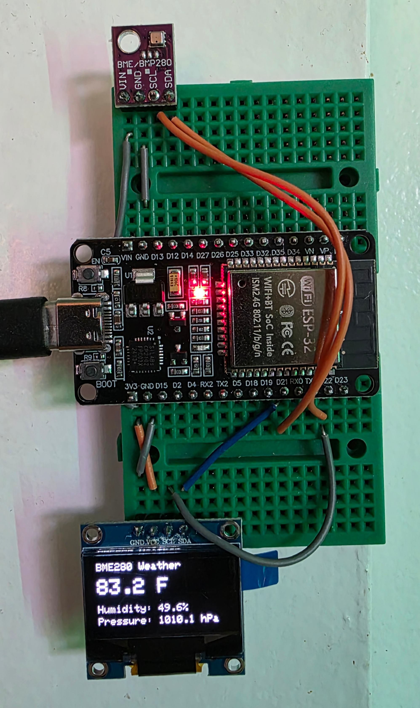

# ESP32 BME280 OLED Weather Display





A simple weather display built with an ESP32, a BME280 environmental sensor, and a 0.96" SSD1306 OLED display.

The project reads temperature, humidity, and atmospheric pressure from the BME280 and displays the values on the OLED screen. Temperature is converted from Celsius to Fahrenheit before being displayed.

## Hardware

* ESP32 Development Board
* BME280 Sensor Module (I2C, address `0x76`)
* SSD1306 OLED Display (128x64, I2C, address `0x3C`)
* Jumper wires
* Breadboard (optional)

## Wiring

Both devices use the same I2C bus.

| ESP32   | BME280 | OLED |
| ------- | ------ | ---- |
| 3.3V    | VIN    | VCC  |
| GND     | GND    | GND  |
| GPIO 21 | SDA    | SDA  |
| GPIO 22 | SCL    | SCL  |

## Required Libraries

Install the following libraries using the Arduino IDE Library Manager:

* Adafruit BME280 Library
* Adafruit Unified Sensor
* Adafruit SSD1306
* Adafruit GFX Library

## Features

* Displays temperature in Fahrenheit
* Displays relative humidity
* Displays atmospheric pressure in hPa
* Updates automatically every 2 seconds
* Uses a shared I2C bus for both devices

## Display Layout

```text
BME280 Weather

83.9 F

Humidity: 48.7%
Pressure: 1010.8 hPa
```

## How It Works

The ESP32 communicates with both the BME280 sensor and SSD1306 display over I2C.

During each loop cycle:

1. Temperature is read from the BME280.
2. Temperature is converted from Celsius to Fahrenheit.
3. Humidity is read from the BME280.
4. Atmospheric pressure is read from the BME280.
5. The OLED display is cleared.
6. Updated values are drawn on the screen.
7. The display is refreshed.
8. The system waits 2 seconds before repeating.

## I2C Addresses

| Device       | Address |
| ------------ | ------- |
| BME280       | `0x76`  |
| SSD1306 OLED | `0x3C`  |

## Update Interval

The display refreshes every 2 seconds:

```cpp
delay(2000);
```

To change the refresh rate, adjust the delay value in the `loop()` function.

## Example Output

```text
Temperature: 83.9 F
Humidity: 48.7%
Pressure: 1010.8 hPa
```

